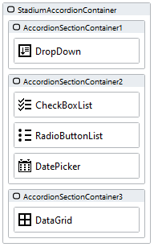
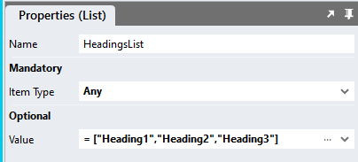
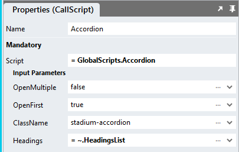

# Accordion

An accordion menu is a vertically stacked list of headers that can be clicked to reveal or hide content associated with them. Accordions shorten pages and reduce scrolling, but they increase the interaction cost by requiring people to decide on topic headings.

https://github.com/stadium-software/accordion/assets/2085324/15d3ea4d-bcd9-4fc8-966d-7d582eaf92de

## Sample applications
This repo contains one Stadium 6.7 application
[Accordion.sapz](Stadium6/Accordion.sapz?raw=true)

## Version 
1.0 initial

# Setup

## Application Setup
1. Check the *Enable Style Sheet* checkbox in the application properties

## Global Script Setup
1. Create a Global Script called "Accordion"
2. Add the input parameters below to the Global Script
   1. ClassName
   2. Headings
   3. OpenFirst
   4. OpenMultiple
3. Drag a *JavaScript* action into the script
4. Add the Javascript below into the JavaScript code property
```javascript
/* Stadium Script version 1.0 https://github.com/stadium-software/accordion */
const className = ~.Parameters.Input.ClassName;
const cssClass = "." + className;
let accordionContainers = document.querySelectorAll(cssClass);
let accordionContainer;
if (accordionContainers.length == 0) {
    console.error("The class '" + className + "' is not assigned to any Container control");
    return false;
} else if (accordionContainers.length > 1) {
    console.error("The class '" + className + "' is assigned to multiple controls. Each accordion must have a unique classname");
    return false;
} else { 
    accordionContainer = accordionContainers[0];
    accordionContainer.classList.add("stadium-accordion");
}

let arrHeadings = ~.Parameters.Input.Headings;
if (!arrHeadings) arrHeadings = [];
let openmultiple = ~.Parameters.Input.OpenMultiple;
let startopen = ~.Parameters.Input.OpenFirst;

let toggleAccordion = (e) => {
    if (!openmultiple) { 
        let openAccs = accordionContainer.querySelectorAll(".expand.stadium-accordion-section");
        for (let i = 0; i < openAccs.length; i++) {
            openAccs[i].classList.remove("expand");
         }
    }
    let section = e.target.closest(".stadium-accordion-section");
    section.classList.toggle("expand");
};
let initAccordion = () => {
    let accordionSections = accordionContainer.children;
    for (let i = 0; i < accordionSections.length; i++) {
        if (!accordionSections[i].querySelector(".container-layout")) { 
            accordionSections[i].remove();
            continue;
        }
        accordionSections[i].classList.add("stadium-accordion-section");
        let header = document.createElement("div");
        header.classList.add("stadium-accordion-header");
        header.addEventListener("click", toggleAccordion);
        if (arrHeadings.length > i) header.innerHTML = arrHeadings[i];
        accordionSections[i].insertBefore(header, accordionSections[i].firstChild);
        let innerSection = accordionSections[i].querySelector(".container-layout");
        innerSection.classList.add("stadium-accordion-inner");
        let innerDiv = document.createElement("div");
        let innerChildren = innerSection.querySelectorAll(".stack-layout-container");
        for (let j = 0; j < innerChildren.length; j++) {
            innerDiv.appendChild(innerChildren[j]);
        }
        innerSection.appendChild(innerDiv);
        if (startopen && i == 0) { 
            accordionSections[i].classList.toggle("expand");
        }
    }
};
initAccordion();
```

## Page Setup
1. Drag a *Container* control to a page
2. Add a class of your choosing to the container's *Classes* property (e.g. stadium-accordion)
3. To create Accordion Sections, drag any number of *Container* controls into the main *Container* control
4. Place any nuber of controls inside the Accordion Section containers



## Page.Load Setup
1. Drag the Global Script called "Accordion" into the Page.Load event handler
2. Provide values for the scripts input parameters
   1. ClassName: The classname of the accordion parent container (e.g. stadium-accordion)
   2. Headings: A lits of headings containing the accordion header text (you can use a *List* control and pass that in or just provide a Javascript array directly instead)
   3. OpenFirst: A boolean to define if the accordion's first section will initially be shown open
   4. OpenMultiple: A boolean to define if multiple accordion sections can be opened at the same time





## Applying the CSS
The CSS below is required for the correct functioning of the module. Some elements can be [customised](#customising-css) using a variables CSS file. 

**Stadium 6.6 or higher**
1. Create a folder called "CSS" inside of your Embedded Files in your application
2. Drag the two CSS files from this repo [*accordion-variables.css*](accordion-variables.css) and [*accordion.css*](accordion.css) into that folder
3. Paste the link tags below into the *head* property of your application
```html
<link rel="stylesheet" href="{EmbeddedFiles}/CSS/accordion.css">
<link rel="stylesheet" href="{EmbeddedFiles}/CSS/accordion-variables.css">
``` 


**Versions lower than 6.6**
1. Copy the CSS from the two css files into the Stylesheet in your application

## Customising CSS
1. Open the CSS file called [*accordion-variables.css*](accordion-variables.css) from this repo
2. Adjust the variables in the *:root* element as you see fit
3. Overwrite the file in the CSS folder of your application with the customised file

## CSS Upgrading
To upgrade the CSS in this module, follow the [steps outlined in this repo](https://github.com/stadium-software/samples-upgrading)
