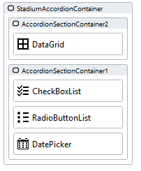

# Accordion

An accordion menu is a vertically stacked list of headers that can be clicked to reveal or hide content associated with them. Accordions shorten pages and reduce scrolling, but they increase the interaction cost by requiring people to decide on topic headings.


## Version 
1.1 Bug Fix: repeated accordions on reinitialise

1.2 Added scrollbar to wide accordions; changed "OpenFirst" parameter to "OpenAccordion" (int); added functionality to close an open accordion on click of the header; upgraded CSS to work with Stadium 6.12+; updated px to rem

1.3 Integrated CSS with script

# Setup

## Application Setup
1. Check the *Enable Style Sheet* checkbox in the application properties

## Global Script Setup
1. Create a Global Script called "Accordion"
2. Add the input parameters below to the Global Script
   1. ClassName
   2. Headings
   3. OpenAccordion
   4. OpenMultiple
3. Drag a *JavaScript* action into the script
4. Add the Javascript below unchanged into the JavaScript code property
```javascript
/* Stadium Script version 1.3 https://github.com/stadium-software/accordion */
const className = ~.Parameters.Input.ClassName;
const cssClass = "." + className;
let accordionContainers = document.querySelectorAll(cssClass);
let accordionContainer;
if (accordionContainers.length == 0) {
    console.error("The class '" + className + "' is not assigned to any Container control");
    return false;
} else if (accordionContainers.length > 1) {
    console.error("The class '" + className + "' is assigned to multiple controls. Each accordion must have a unique classname");
    return false;
}
accordionContainer = accordionContainers[0];
if (accordionContainer.querySelector(".stadium-accordion-section")) return false;
accordionContainer.classList.add("stadium-accordion");

let arrHeadings = ~.Parameters.Input.Headings;
if (!Array.isArray(arrHeadings)) arrHeadings = [];
let openmultiple = ~.Parameters.Input.OpenMultiple;
let startopen = ~.Parameters.Input.OpenAccordion;
if (!Number.isInteger(startopen)) startopen = false;

let toggleAccordion = (e) => {
    let section = e.target.closest(".stadium-accordion-section");
    let toggleMe = !section.classList.contains("expand") || openmultiple;
    if (!openmultiple) { 
        let openAccs = accordionContainer.querySelectorAll(".expand.stadium-accordion-section");
        for (let i = 0; i < openAccs.length; i++) {
            openAccs[i].classList.remove("expand");
         }
    }
    if (toggleMe) section.classList.toggle("expand");
};
let initAccordion = () => {
    let accordionSections = accordionContainer.children;
    let counter = 1;
    for (let i = 0; i < accordionSections.length; i++) {
        if (!accordionSections[i].querySelector(".container-layout")) { 
            accordionSections[i].remove();
            continue;
        }
        accordionSections[i].classList.add("stadium-accordion-section");
        let header = document.createElement("div");
        header.classList.add("stadium-accordion-header");
        header.addEventListener("click", toggleAccordion);
        if (arrHeadings.length > i) header.innerHTML = arrHeadings[i];
        accordionSections[i].insertBefore(header, accordionSections[i].firstChild);
        let innerSection = accordionSections[i].querySelector(".container-layout");
        innerSection.classList.add("stadium-accordion-inner");
        let innerDiv = document.createElement("div");
        let innerChildren = innerSection.querySelectorAll(".stack-layout-container");
        for (let j = 0; j < innerChildren.length; j++) {
            innerDiv.appendChild(innerChildren[j]);
        }
        innerSection.appendChild(innerDiv);
        if (startopen && counter == startopen) { 
            accordionSections[i].classList.add("expand");
        }
        counter ++;
    }
};
function loadCSS() {
    let moduleID = "stadium-module";
    if (!document.getElementById(moduleID)) {
        let cssMain = document.createElement("style");
        cssMain.id = moduleID;
        cssMain.type = "text/css";
        cssMain.textContent = `

.stadium-accordion {
    & .stadium-accordion-section {
        padding-right: 1.6rem;
        margin-top: 1rem;
        border: 0.1rem solid var(--stadium-accordion-border-color, #fff);
    }

    & .stadium-accordion-inner {
        display: grid;
        grid-template-rows: 0fr;
        transition: grid-template-rows var(--stadium-accordion-expansion-speed, 500ms);
        vertical-align: top;
        background-color: var(--stadium-accordion-background-color, #fff);
    }

    & .expand .stadium-accordion-inner {
        grid-template-rows: 1fr;
    }

    & .stadium-accordion-inner > div {
        overflow-y: hidden;
        overflow-x: auto;
    }

    & .stadium-accordion-header {
        position: relative;
        display: flex;
        align-items: center;
        font-size: var(--stadium-accordion-header-font-size, 1.6rem);
        color: var(--stadium-accordion-header-font-color, var(--BODY-FONT-COLOR));
        padding: var(--stadium-accordion-header-topbottom-padding, 1.2rem) var(--stadium-accordion-header-rightleft-padding, 1.2rem);
        padding-right: max(3.6rem, var(--stadium-accordion-header-rightleft-padding, 1.2rem));
        cursor: pointer;
        min-height: var(--stadium-accordion-header-collapse-image-size, 2rem);
        background-color: var(--stadium-accordion-header-background-color, #f5f5f5);
    }

    & .stadium-accordion-header:before {
        content: "";
        position: absolute;
        width: var(--stadium-accordion-header-collapse-image-size, 2rem);
        height: 100%;
        top: 0;
        right: var(--stadium-accordion-header-rightleft-padding, 1.2rem);
        background-image: var(--stadium-accordion-header-collapse-image, url('data: image/svg+xml;base64,PHN2ZyB4bWxucz0iaHR0cDovL3d3dy53My5vcmcvMjAwMC9zdmciIHdpZHRoPSIxZW0iIGhlaWdodD0iMWVtIiB2aWV3Qm94PSIwIDAgNTEyIDUxMiI+PHBhdGggZmlsbD0iIzg4ODg4OCIgZD0ibTY0IDE0NGwxOTIgMjI0bDE5Mi0yMjRINjR6Ii8+PC9zdmc+'));
        background-repeat: no-repeat;
        background-position: center;
        background-size: var(--stadium-accordion-header-collapse-image-size, 2rem);
        transition: transform var(--stadium-accordion-expansion-speed, 500ms);
        transform: rotate(0deg);
    }

    & .expand .stadium-accordion-header:before {
        transform: rotate(180deg);
    }
}
html {
    min-height: 100%;
    font-size: 62.5%;
}        
        `;
        document.head.appendChild(cssMain);
    }
}
loadCSS();
initAccordion();
```

## Page Setup
1. Drag a *Container* control to a page
2. Add a class of your choosing to the container's *Classes* property (e.g. stadium-accordion)
3. To create Accordion sections, drag any number of *Container* controls into the main *Container* control
4. Place any nuber of controls inside the Accordion Section containers



## Page.Load Setup
1. Drag the Global Script called "Accordion" into the Page.Load event handler
2. Provide values for the scripts input parameters
   1. ClassName: The classname of the accordion parent container (e.g. stadium-accordion)
   2. Headings: A lits of headings containing the accordion header text (you can use a *List* control and pass that in or just provide a Javascript array directly instead)
   3. OpenAccordion (optional): An integer that defines which Accordion will initially be shown open
   4. OpenMultiple (optional): A boolean to define if multiple accordion sections can be opened at the same time (default: false)


## CSS
Variables exposed in the [*accordion-variables.css*](accordion-variables.css) file can be [customised](#customising-css).

### Customising CSS
1. Open the CSS file called [*accordion-variables.css*](accordion-variables.css) from this repo
2. Adjust the variables in the *:root* element as you see fit
3. Stadium 6.12+ users can comment out any variable they do **not** want to customise
4. Add the [*accordion-variables.css*](accordion-variables.css) to the "CSS" folder in the EmbeddedFiles (overwrite)
5. Paste the link tag below into the *head* property of your application (if you don't already have it there)
```html
<link rel="stylesheet" href="{EmbeddedFiles}/CSS/accordion-variables.css">
``` 
6. Add the file to the "CSS" inside of your Embedded Files in your application

**NOTE: Do not change any of the CSS in the 'accordion.css' file**

## Upgrading Stadium Repos
Stadium Repos are not static. They change as additional features are added and bugs are fixed. Using the right method to work with Stadium Repos allows for upgrading them in a controlled manner. 

How to use and update application repos is described here: [Working with Stadium Repos](https://github.com/stadium-software/samples-upgrading)